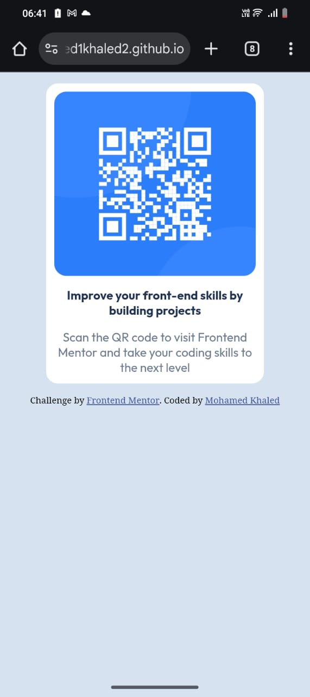

# Frontend Mentor - QR code component solution

This is a solution to the [QR code component challenge on Frontend Mentor](https://www.frontendmentor.io/challenges/qr-code-component-iux_sIO_H). Frontend Mentor challenges help you improve your coding skills by building realistic projects. 

## Table of contents

- [Overview](#overview)
  - [Screenshot](#screenshot)
  - [Links](#links)
- [My process](#my-process)
  - [Built with](#built-with)
  - [What I learned](#what-i-learned)
  - [Continued development](#continued-development)
- [Author](#author)

## Overview

### Screenshot





### Links

- Live Site URL: [https://mohamed1khaled2.github.io/QR-code-component/](https://mohamed1khaled2.github.io/QR-code-component/)

## My process

### Built with

- Semantic HTML5 markup
- CSS custom properties
- Flexbox
- Mobile-first workflow


### What I learned

This project helped me strengthen my understanding of basic HTML and CSS layout techniques. Some key things I learned include:

How to use Flexbox to center elements both vertically and horizontally

Structuring a simple card layout with semantic HTML

Applying consistent spacing, font sizes, and border-radius to match a design

To see how you can add code snippets, see below:

```html
<div class="qr">
  
</div>
```
```css
.qr-viewer {
    display: flex;
    flex-direction: column;
    justify-content: space-between;
    height: 350px;
    width: 250px;
    background-color: hsl(0, 0%, 100%);
    padding: 10px;
    border-radius: 15px;
    -webkit-border-radius: 15px;
    -moz-border-radius: 15px;
    -ms-border-radius: 15px;
    -o-border-radius: 15px;
    text-align: center;
}
```

### Continued development
I'm currently focusing on improving my front-end development skills by building more real-world projects. I’m working on becoming more confident with:

Responsive web design

Advanced CSS techniques (Flexbox, Grid, animations)

JavaScript fundamentals

Working with design systems and UI libraries

I also plan to start learning popular JavaScript frameworks like React to build more dynamic and interactive user interfaces.

## Author

- Frontend Mentor - [@Mohamed1khaled2](https://www.frontendmentor.io/profile/@Mohamed1khaled2)
- X - [Mohamed Khaled](https://x.com/mada_555)
